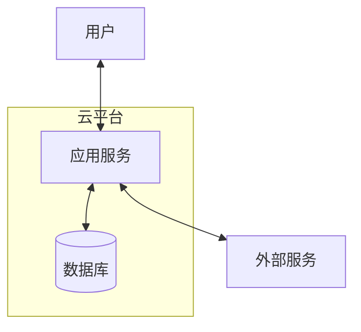

# tech-stack-advisor — 技术栈选型顾问

> 根据项目类型、目标平台、团队背景、部署要求，推荐最小可用的技术栈，并输出技术方案模板。适用于 vibe coding 场景下快速确定技术方向。

## 触发条件

以下任一情况发生时，**MUST** 调用本 skill：

1. 用户问"这个项目用什么技术做"
2. 用户说"帮我选一个技术栈"
3. 项目启动时需要确定技术方案
4. 用户已有技术偏好，需要验证是否适合当前项目

## 输入

- `platform`: 目标平台（`web` / `ios` / `android` / `mini-program` / `cross-platform` / `ai-agent`）
- `project_type`: 项目类型（`content-site` / `dashboard` / `social` / `e-commerce` / `ai-chat` / `tool`）
- `team_background`: 团队技术背景（`frontend-heavy` / `backend-heavy` / `fullstack` / `mobile-native` / `no-code-background`）
- `deployment_target`: 部署目标（`domestic-cloud` / `overseas-cloud` / `self-hosted` / `serverless` / `app-store`）
- `realtime_requirement`: 是否需要实时能力（`sse` / `websocket` / `none`）
- `ai_integration`: 是否需要集成 AI（`yes` / `no`）
- `budget_constraint`: 预算约束（`free-tier` / `low-budget` / `standard` / `enterprise`）

## 推荐矩阵

### Web 项目

| 场景 | 推荐技术栈 | 理由 |
|---|---|---|
| **内容型/展示型** | Next.js / Astro + Tailwind + Vercel | SEO 友好、静态生成、部署简单 |
| **Dashboard/管理后台** | Next.js + shadcn/ui + Prisma + PostgreSQL | 全栈能力、组件丰富、TypeScript 安全 |
| **AI Chat/实时流** | Next.js + Vercel AI SDK + SSE + PostgreSQL | 流式响应、Serverless 友好、AI SDK 封装复杂协议 |
| **电商** | Next.js + Stripe + PostgreSQL + Redis | 成熟生态、支付集成、会话管理 |
| **低预算个人项目** | Next.js + SQLite + Vercel/Zeabur | 零数据库成本、一键部署 |

### iOS 项目

| 场景 | 推荐技术栈 | 理由 |
|---|---|---|
| **原生体验优先** | Swift + SwiftUI + CoreData/CloudKit | 性能最好、Apple 生态集成最深 |
| **快速原型/MVP** | SwiftUI + Supabase/Firebase | 减少后端工作、实时同步 |
| **跨平台复用** | React Native / Flutter | 如果同时有 Android 需求 |

### Android 项目

| 场景 | 推荐技术栈 | 理由 |
|---|---|---|
| **原生体验优先** | Kotlin + Jetpack Compose + Room | Google 官方推荐、声明式 UI |
| **快速原型/MVP** | Jetpack Compose + Firebase | 减少后端工作 |
| **跨平台复用** | Flutter / React Native | 一套代码双端运行 |

### 小程序

| 场景 | 推荐技术栈 | 理由 |
|---|---|---|
| **微信生态** | 微信原生 / Taro + React | 原生能力最全 / 可复用 Web 技术 |
| **多平台小程序** | uni-app / Taro | 一套代码发布到微信、支付宝、抖音等多端 |
| **AI 能力** | 微信原生 + 云开发 + 大模型 API | 云开发减少服务端工作 |

### AI 产品特有

| 需求 | 推荐方案 |
|---|---|
| **大模型调用** | Vercel AI SDK / LangChain / 直接调用 OpenAI 兼容 API |
| **流式响应** | SSE (Server-Sent Events) / Vercel AI SDK stream protocol |
| **多 Agent 编排** | 自建 orchestrator + Promise.allSettled |
| **上下文管理** | tiktoken 估算 + 滚动摘要压缩 |
| **Prompt 版本管理** | 数据库存储 + systemPromptSnapshot 冻结历史 |

## 工作流

### Step 1 — 约束分析

根据输入参数，分析项目的硬性约束：

| 约束维度 | 关键问题 |
|---|---|
| **国内/海外** | 国内需考虑备案、CDN、大陆访问速度；海外可选 Vercel/Render/Netlify |
| **预算** | 免费层 → SQLite/Vercel；低预算 → Zeabur/Railway；标准 → AWS/GCP 轻量 |
| **实时性** | SSE 适合单向推送（AI 流式）；WebSocket 适合双向实时（聊天室、协同） |
| **AI 集成** | 国内 → 月之暗面/文心/通义；海外 → OpenAI/Claude/Gemini |
| **团队背景** | 前端强 → Next.js 全栈；后端强 → 前后端分离；移动端强 → 原生开发 |

### Step 2 — 推荐技术栈

给出**最小可用技术栈**（不超过 7 个核心依赖）：

```markdown
## 推荐技术栈

| 层 | 选型 | 版本 | 备注 |
|---|---|---|---|
| 框架 | {name} | {version} | {理由} |
| 语言 | {name} | {version} | {理由} |
| UI 库 | {name} | {version} | {理由} |
| 样式 | {name} | {version} | {理由} |
| 数据库 | {name} | {version} | {理由} |
| ORM/数据层 | {name} | {version} | {理由} |
| AI SDK | {name} | {version} | {理由} |
| 部署 | {name} | - | {理由} |
```

### Step 3 — 架构图

用 Mermaid flowchart 画出系统架构：



### Step 4 — 项目目录结构

给出推荐的项目目录树，标注每个目录的职责。

### Step 5 — 第三方服务清单

列出所有需要申请的第三方服务及凭证存放位置：

| 服务 | 用途 | 凭证形式 | 存放位置 |
|---|---|---|---|
| {服务名} | {用途} | API Key / OAuth | 环境变量 `{NAME}` |

### Step 6 — 关键依赖配置

给出关键依赖的具体配置建议（如 TypeScript strict 模式、Tailwind darkMode、Prisma provider 切换等）。

### Step 7 — 本地开发 Quick Start

给出 3~5 步的本地启动命令。

## 输出格式

```markdown
# Tech Stack Advisor 报告

## 1. 约束分析
（国内/海外、预算、实时性、AI、团队背景的判定结果）

## 2. 推荐技术栈
（表格 + 每项选择的理由）

## 3. 架构图
（Mermaid）

## 4. 项目目录结构
（目录树）

## 5. 第三方服务清单

## 6. 关键依赖配置

## 7. 本地开发 Quick Start

## 8. 备选方案（如适用）
（如果推荐方案不适合，给出 Plan B）
```

## 防退化规则

1. **MUST NOT** 推荐超过 7 个核心依赖——vibe coding 的核心是减少认知负担。
2. **MUST NOT** 推荐团队完全不熟悉的技术栈，除非用户明确要求学习新技术。
3. **MUST** 为每个选型给出"如果不选它，会怎样"的对比说明。
4. **MUST** 标注每个第三方服务的免费额度上限，防止预算超支。
5. **SHOULD** 给出"降级方案"——如果某个服务不可用，可以替换成什么。
